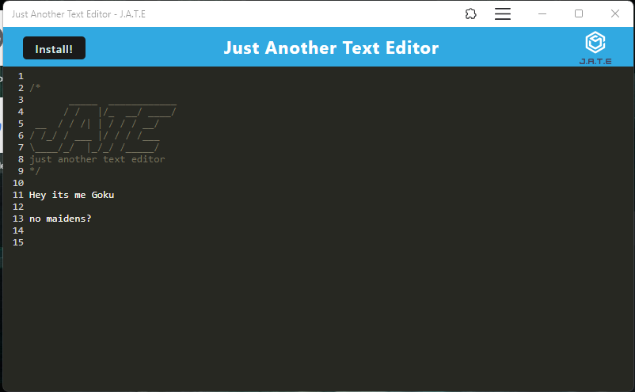

# Just Another Text Editor

## Description

Simple text editor that runs in the browser

  
## Table of Contents
   
- [Installation](#installation)
- [Usage](#usage)
- [Credits](#credits)
- [License](#license)
- [Badges](#badges)
- [Features](#features)
- [Contact](#contact)
  
## Installation
  
Goto url link and type text, can pop out of browser 
  
## Usage
  
Type text and click off screen for changes to be saved
  
## Credits
  

  
## License
  
MIT License
  
## Badges
    

  
## Features
  
N/a

## Feedback / Contact

If you have any questions or feedback can reach me at Github, email or LinkedIn down below

* Github : [solomonkrow](https://www.github.com/solomonkrow)
* E-mail : solomonkrow@outlook.com
* LinkedIn : [solomonkrow](https://www.linkedin.com/in/solomonkrow)

